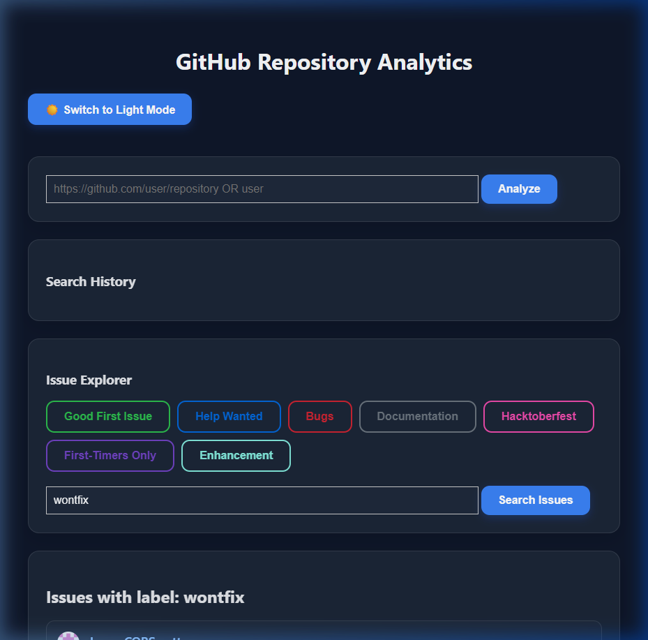
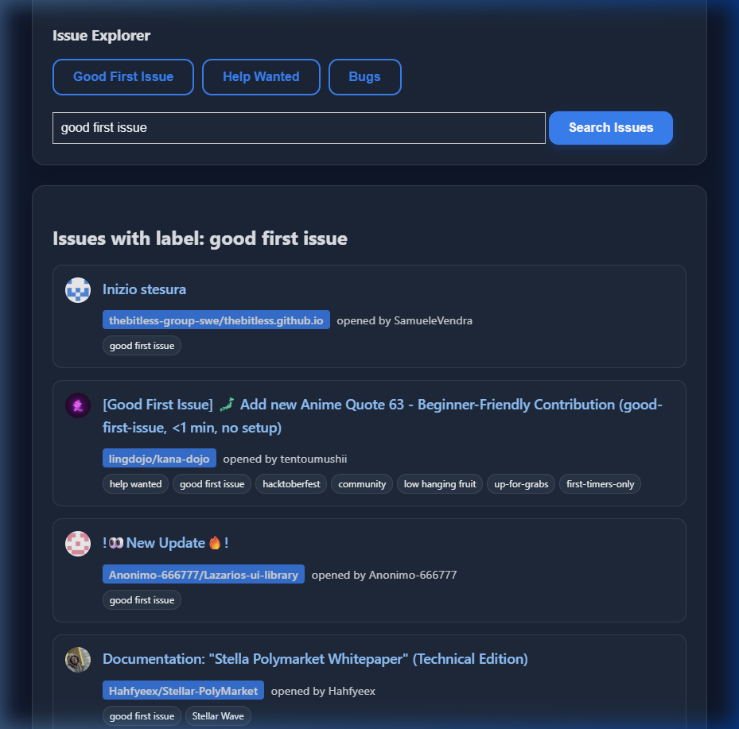
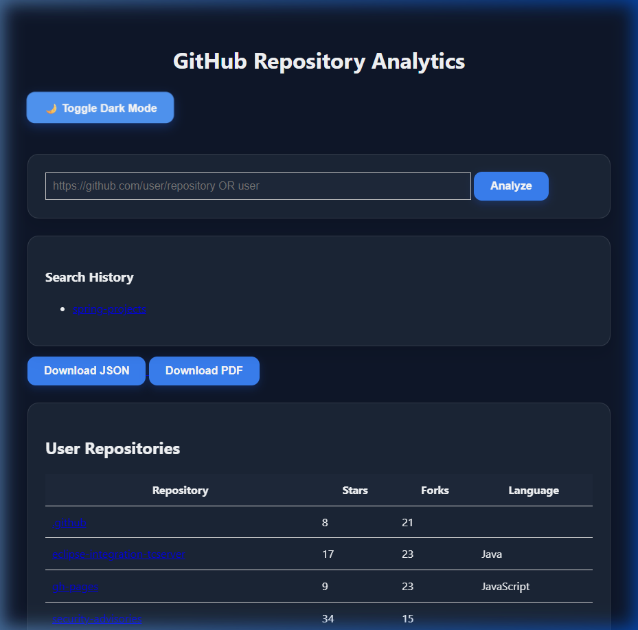

# 🚀 GitHub Analytics & Issue Discovery Dashboard (V2.0)

Una potente aplicación web desarrollada con **Java + Spring Boot** para analizar repositorios y descubrir oportunidades de contribución en GitHub en tiempo real.

---

## ✨ Features

* 🔍 **Análisis de Repositorios**: Métricas de estrellas, forks y watchers.
* 👤 **Análisis de Usuarios**: Exploración completa de repositorios por perfil.
* 📊 **Gráficos Interactivos**: Visualizaciones dinámicas con Chart.js (Commits, Lenguajes, Métricas).
* 👥 **Top Contributors**: Identifica a los colaboradores más activos.
* 🛠️ **Issue Explorer (NUEVO)**: Encuentra issues por etiquetas (`good first issue`, `help wanted`, etc.) en todo GitHub.
* 🌙 **Premium Dark Mode**: Interfaz moderna con Glassmorphism y guardado de preferencia.
* 🕘 **Historial de Búsquedas**: Acceso rápido a tus análisis previos.
* 📄 **Exportación Pro**: Genera reportes en **PDF** y descarga datos en **JSON**.

---

## 🛠️ Tech Stack

**Backend**
* Java 17 + Spring Boot 3.x
* **Spring Cache**: Optimización de peticiones a la API.
* **Async Processing**: Procesamiento paralelo de métricas con `CompletableFuture`.
* **Lombok**: Código limpio y mantenible.

**Frontend**
* Thymeleaf + Vanilla CSS (Glassmorphism design).
* Chart.js (Tematizado dinámicamente).

---

## 📸 Screenshots

Aquí tienes una vista previa del nuevo diseño premium:

### Dashboard Principal (Modo Oscuro)


### Explorador de Issues


### Análisis Detallado


---

## 🚀 Getting Started

1. **Clonar el repositorio:**
   ```bash
   git clone https://github.com/albertorm005/github-dashboard.git
   cd github-dashboard
   ```

2. **Configurar Token (Recomendado):**
   Para evitar límites de la API de GitHub, configura tu token en `src/main/resources/application.properties` o como variable de entorno:
   ```bash
   export GITHUB_TOKEN=tu_token_aqui
   ```

3. **Ejecutar:**
   ```bash
   ./mvnw spring-boot:run
   ```

4. **Acceder:**
   Abre [http://localhost:8080](http://localhost:8080) en tu navegador.

---

## 👨‍💻 Author & Version

* **Versión actual**: 2.0.0 (Massive Overhaul)
* **Autor Original**: Alberto Rodríguez
* **Actualizaciones**: Refactorización completa, Issue Explorer y Rediseño.

---
